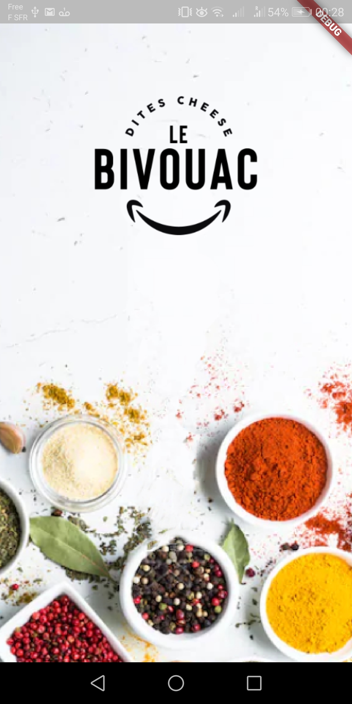
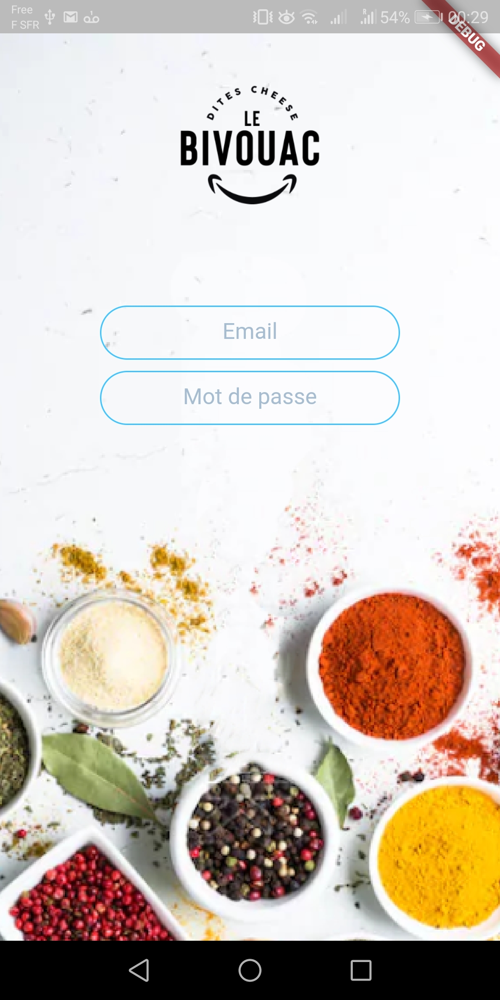
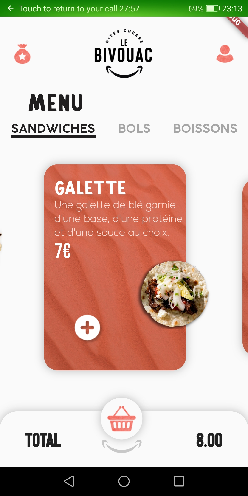
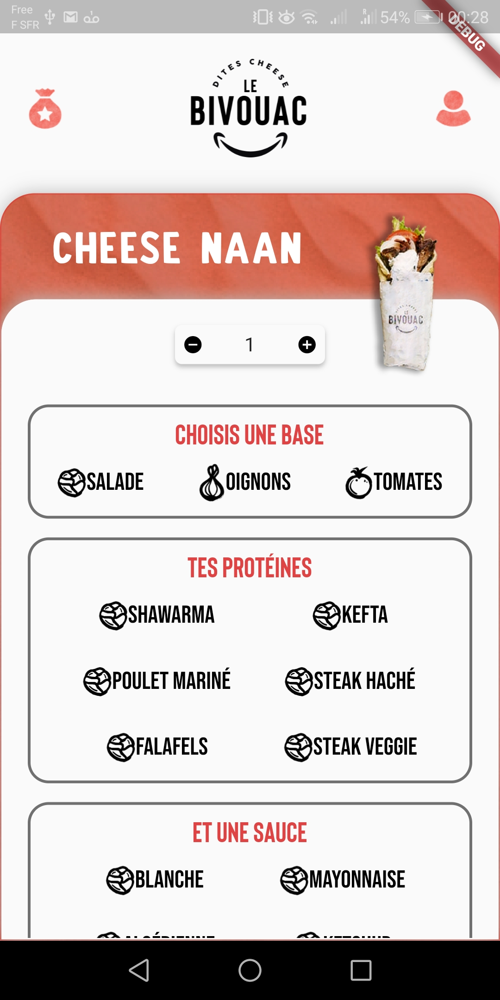
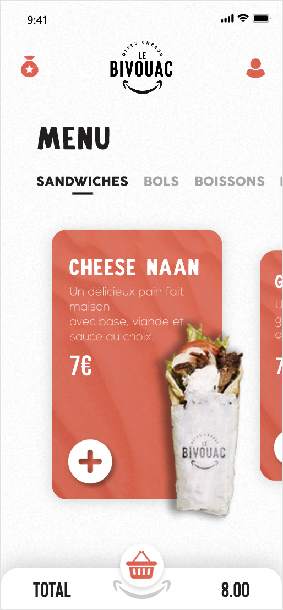

# Bivouac (UNDER DEVELOPMENT)

Official Bivouac mobile application: designed for Bivouac restaurant in Clermont-Ferrand, the app enables the customers to order their favorite meals online and hence to save time and use whatever payment method they want.

The app is still under development and will present the following features:
- selection and customisation of meals 
- review of the cart
- validate and select a payment option
- real-time tracking tool for orders
- creation of customer accounts and subscription to discount programmes

## Getting Started

This project is a starting point for a Flutter application.

A few resources to get you started if this is your first Flutter project:

- [Lab: Write your first Flutter app](https://flutter.dev/docs/get-started/codelab)
- [Cookbook: Useful Flutter samples](https://flutter.dev/docs/cookbook)

For help getting started with Flutter, view our 
[online documentation](https://flutter.dev/docs), which offers tutorials, 
samples, guidance on mobile development, and a full API reference.
